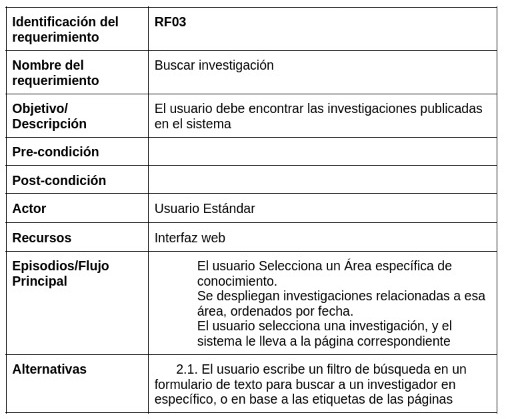
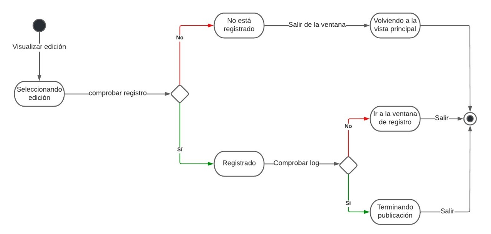
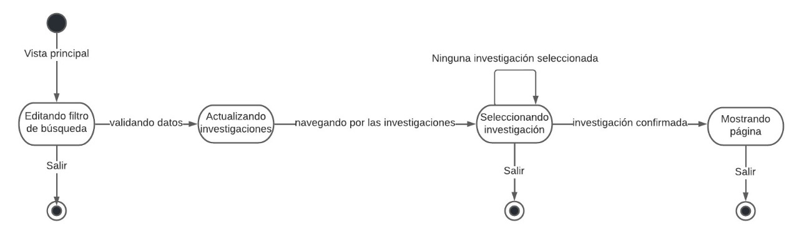
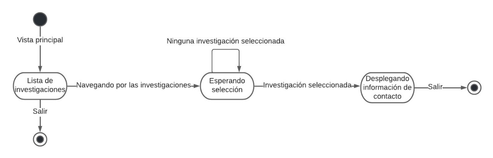
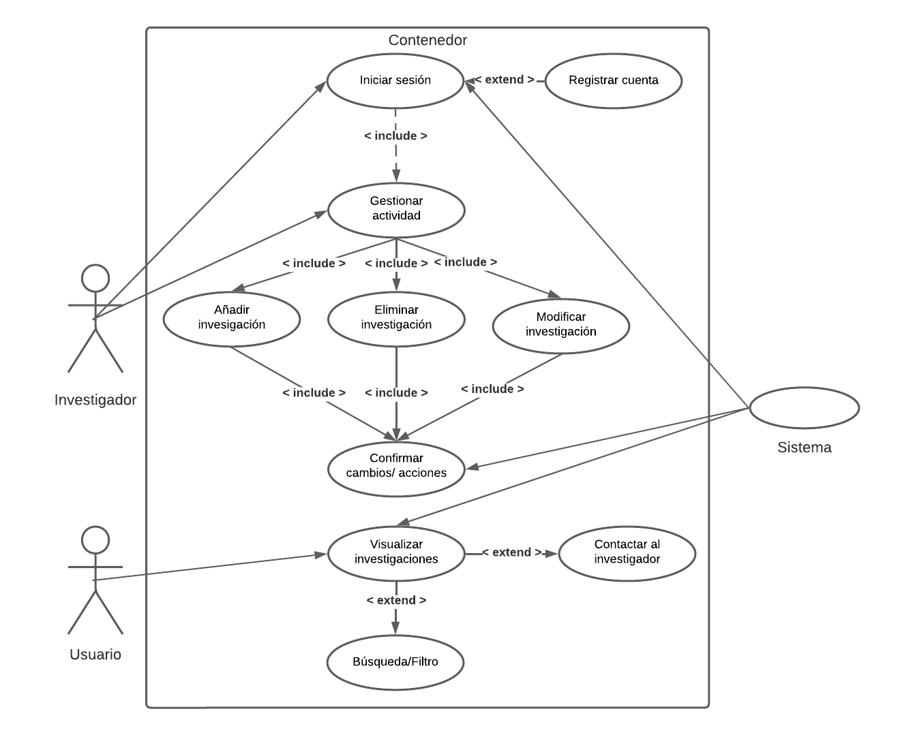

# BeResearcher - Software Engineering 3

## 1. Integrantes

- Eden Palli Livisi 
- Chura Navarro, Ckaroll Darlene 
- Moroco Ramos, Luis Angel
- Valdivia Quispe, Eduardo Felipe 
- Valencia Arana, Gabriel Adriano

## 2. BeRearcher 

### 2.1 Contexto

Las investigaciones en LATAM sobre la producción científica en estudiantes universitarios muestras 
que son pocos los alumnos que pueden hacer ciencia por diferentes motivos como la falta inversión, falta de ayuda o motivación.
En este proyecto abordaremos el problema de la falta de promoción de proyectos impulsados por profesores de las escuelas 
profesionales.

### 2.2 ¿Qué es BeResearcher?

Es una aplicación web que le permitirá a los profesores promocionar sus investigaciones actuales a los estudiantes universitarios. Aquí los alumnos 
podrán estar al tanto de los proyectos de los investigadores, de sus líneas y así promover el interés de la investigación en la comunidad universitaria. Esta 
aplicación podrá conectar a alumnos interesados en la ciencia con profesores investigadores.

### 2.3 Beneficios

- Promover la investigación 
- Exponer a los científicos universitarios y sus líneas de investigación
- Encontrar fácilmente a científicos especializados 
- Motivar a los estudiantes de pregrado a participar en proyectos interesantes 
- Exponer la ciencia en la universidad

## 3. Aspectos técnicos 

### 3.1 Fronted 
- Javascript 
- ReactJS - Librería
- HTML
- CSS
- Axios

### 3.2 Backend

- ExpressJS - Framework
- Typescript
- NodeJS
- MySQL
- DotENV

### 3.2 Deploy 

- Docker

### 3.3 Patrón de diseño 

- Modelo Vista Controlador

## 4. El sistema  

### 4.1 Los Usuarios 

El sistema cuenta con (2) tipos de usuarios. Sus diferencias son notables.

#### 4.1.1 Usuario - Estándar  

Este usuario podrá acceder directamente al mostrador de investigaciones en la universidad, podrá filtrarlas, buscarlas y contactarse
con los profesores investigadores. Ellos no cuentan con tokens de acceso. Se limitan a informarse.
Podrían ser: Estudiantes universitarios, Tesistas, Público en general, profesores, empresas interesadas, etc.   
 
#### 4.1.2 Usuario - Investigador 

El usuario investigador es una persona que puede publicar su proyecto de investigación y agregar todas las características necesarias. 
Él necesita un token de acceso para ingresar a la plataforma. Su finalidad es ser contactados y exponer su investigación. Pueden ser: Profesores 
investigadores, Tesistas, Investigadores asociados, etc. 

### 4.2 Restricciones 

- El despliegue será local 
- Solo correrá en navegadores web

### 4.3 Requerimientos

#### 4.3.1 Requisitos funcionales

#### 4.3.2 Requisitos NO funcionales

### 4.4 Diagramas de estado

RF01:

RF02:

RF03:

RF04:

### 4.5 Diagrama de casos de uso

### 4.6 Arquitectura de software 

### 4.7 Base de Datos

Modelo Entidad Relacion:

## 5. Mockup

Con base en los requisitos obtenidos, se elaboró un Muckup como prototipo para posteriormente realizar la codificación de la aplicación web. Como páginas principales tomamos:

- Home: Inicio de la aplicación web, donde se visualizará las funciones.
- Login: Solo para los investigadores.
- Investigaciones: Lugar donde se podrán ver todas las investigaciones que están ejecutando por facultad.
- Información de la investigación: En este apartado se dará una información más amplia sobre la investigación que se esté efectuando.

Para la elaboración del prototipo se utilizo la herramienta de Figma: https://www.figma.com/file/hVSpPX0azzJy9hBA2FByNh/BE-RESEARCHER?node-id=0%3A1

